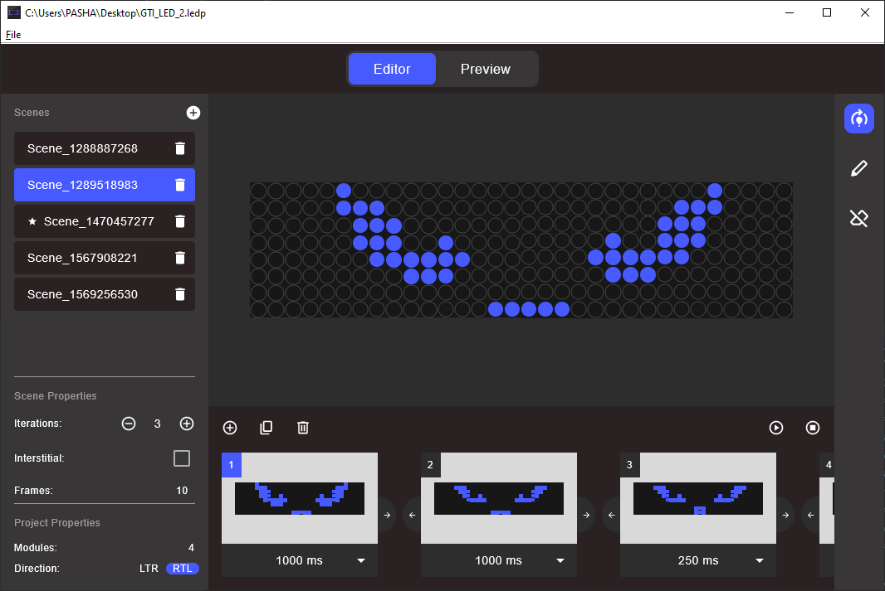

# Led Panel Studio

This project is a simple tool for creating animations for use with Arduino controllers, along with MAX7219 modules. It enables easy creation of frame animations and exports them as Arduino Sketch files. Therefore, you can upload the generated sketch to your Arduino and have your animation operational in no time.

## Installation

### Windows

To install this application, navigate to the **/release** directory of this repository and download the MSI installer.

### macOS

At present, the macOS installer is not available.

### Alternative

You can always clone this repository and build the application yourself :)

## LPS Usage

Upon opening the application, the initial step involves creating a new project. To do this, navigate to **File -> New Project**. Here, you will define the number of LED modules you wish to include. Once the new project is created, you can begin crafting scenes. To initiate a scene, simply press the **"+"** button located in the Scenes Pane on the left side of the window. In the main working area, you can design your frames. The frames list and their durations are displayed at the bottom of the window. After creating your frames, utilize the **"Play**" button to preview your animation. Finally, you can export your project as an Arduino Sketch by navigating to **File -> Generate Arduino Sketch**.

The Scenes Pane offers several useful configurations. The **Iterations** option allows you to specify how many times your scene will be repeated. The **Interstitial** flag determines which scene should play during transitions between scenes; essentially, it designates the scene to be played between each scene in the list.

Lastly, the Project Properties section includes the **Direction** configuration. **"RTL"** signifies that the data input (pins) are located on the rightmost module, while **"LTR"** indicates that the pins are situated on the leftmost module.

## Uploading to Arduino

This tool generates Arduino Sketches using the **MD_MAX72xx.h** library. Therefore, ensure that you have included this library in your Arduino IDE before proceeding.

